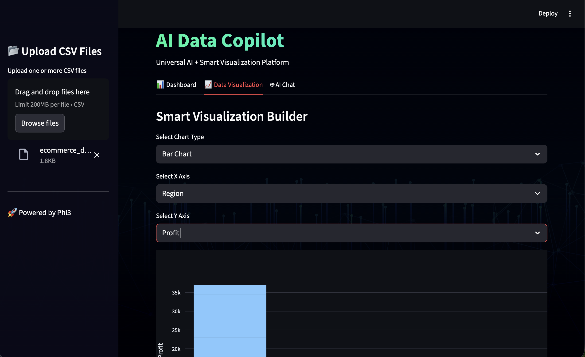
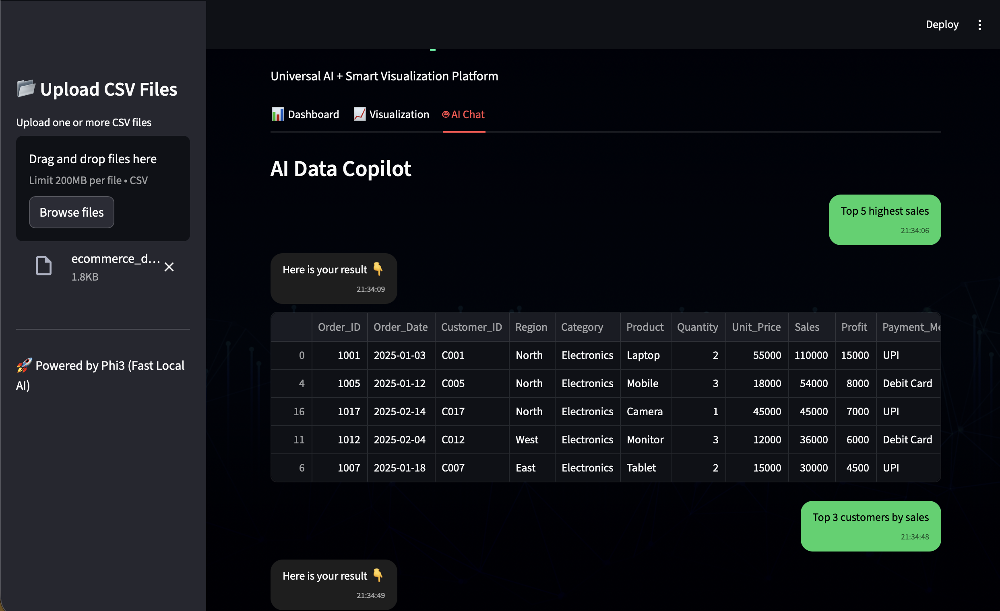

# 🚀 AI Data Copilot

An intelligent CSV analysis platform powered by Local LLM (Ollama).

---

## 📸 Demo Screenshots

### 📊 Dashboard
# 1

# 2

# 3


---

### 📈 Data Visualization Builder
# 1

# 2


---

### 🤖 AI Chat Interface (WhatsApp Style)
# 1

# 2

# 3


---

## ✨ Features

- 📂 Multi CSV Upload  
- 📊 Smart Data Visualization  
- 📈 Interactive Chart Builder  
- 🤖 AI Powered Natural Language Queries  
- 💬 WhatsApp-Style Chat UI  
- 📄 AI PDF Report Generator  
- ⚡ Fast Local Model (Phi3 via Ollama)  
- 🔐 100% Local & Offline AI  

---

## 🧠 Example Questions You Can Ask

- What is the total profit?  
- What is the average sales?  
- Show total sales by region  
- Top 5 highest sales  
- Profit by category  
- Which region has highest revenue?  
- Show monthly sales trend  
- Show correlation between sales and profit  

---

## 🛠 Built With

- Streamlit  
- Pandas  
- Plotly  
- Ollama (Local LLM - Phi3)  
- Python  

---

## 🚀 Run Locally

### 1️⃣ Clone the Repository

```bash
git clone https://github.com/pratik5906/AI-Data-Copilot.git
cd AI-Data-Copilot
```

### 2️⃣ Install Requirements

```bash
pip install -r requirements.txt
```

### 3️⃣ Install Ollama (Mac)

```bash
brew install ollama
brew services start ollama
```

### 4️⃣ Pull Local Model

```bash
ollama pull phi3
```

### 5️⃣ Run App

```bash
streamlit run app.py
```

---

## 👨‍💻 Author

**Pratik Kumar**  
Founder & Developer  

Built with ❤️ using Streamlit + Local AI (Ollama)

---

## ⭐ Support

If you like this project, give it a ⭐ on GitHub!
